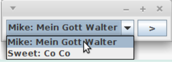
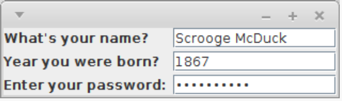
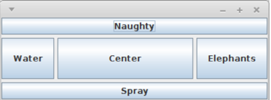
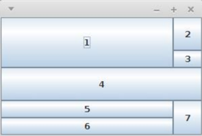
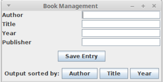

```java
import javax.swing.*;

public class LabelFrame1 {
    public static void main(String[] args) {
        JFrame frame = new JFrame();
        frame.setTitle("Swing frame with label");
        frame.add(new JLabel("Hello!"));
        frame.setSize(300, 150);
        frame.setDefaultCloseOperation(JFrame.EXIT_ON_CLOSE);
        frame.setVisible(true);
    }
}
```

## Methoden von Top-Level-Containern
__JFrame, JWindow__ und __JDialog__

```java
import javax.swing.*;

void setTitle(String s); // Title

void add(Component comp); // Füge Komponente zum Container hinzu

void setSize(int width, int height);

void pack(); // Fenstergröße wird an die bevorzugte Größe und das Layout der Komponenten angepasst

void setDefaultCloseOperation(WindowConstants.DO_NOTHING_ON_CLOSE);
void setDefaultCloseOperation(WindowConstants.HIDE_ON_CLOSE);
void setDefaultCloseOperation(WindowConstants.DISPOSE_ON_CLOSE);
void setDefaultCloseOperation(WindowConstants.EXIT_ON_CLOSE);

void setVisible(boolean b); // Macht das Fenster sichtbar

void dispose(); // Gibt alle systemeigenen Ressourcen des Fensters frei
```

## Layoutmanager
### FlowLayout


Ordnet Komponenten zeilenweise von links nach rechts an
```java
import java.awt.*;
import javax.swing.*;
public class FlowLayoutDemo {
    public static void main(String[] args) {
        JFrame f = new JFrame();
        f.setLayout(new FlowLayout());

        JComboBox choice = new JComboBox();
        choice.addItem("Mike: Mein Gott Walter");
        choice.addItem("Sweet: Co Co");

        f.add(choice);
        f.add(new JButton(">"));
        f.setDefaultCloseOperation(JFrame.EXIT_ON_CLOSE);
        f.pack();
        f.setVisible(true);
    }
}
```
### BoxLayout
Ordnet Komponenten horizontal oder vertikal an
### GridLayout


Setzt Komponenten in ein Raster, wobei jedes Element die gleichen Ausmaße besitzt
```java
import java.awt.*;
import java.text.*;
import javax.swing.*;
public class GridLayoutDemo {
    public static void main(String[] args) {
        JFrame f = new JFrame();
        f.setDefaultCloseOperation(JFrame.EXIT_ON_CLOSE);
        f.setLayout(new GridLayout(3, 2, 6, 3));

        f.add(new JLabel("What's your name?"));
        f.add(new JTextField());
        f.add(new JLabel("Year you were born?"));
        f.add(new JFormattedTextField(NumberFormat.getIntegerInstance()));
        f.add(new JLabel("Enter your password:"));
        f.add(new JPasswordField());

        f.pack();
        f.setVisible(true);
    }
}
```
### BorderLayout


Setzt Komponenten in vier Himmelsrichtungen oder in der Mitte
```java
import java.awt.*;
import javax.swing.*;
public class BorderLayoutDemo {
    public static void main(String[] args) {
        JFrame f = new JFrame();
        f.setDefaultCloseOperation(JFrame.EXIT_ON_CLOSE);
        f.setLayout(new BorderLayout(5, 5));

        f.add(new JButton("Naughty"), BorderLayout.NORTH);
        f.add(new JButton("Elephants"), BorderLayout.EAST);
        f.add(new JButton("Spray"), BorderLayout.SOUTH);
        f.add(new JButton("Water"), BorderLayout.WEST);
        f.add(new JButton("Center"));

        f.setSize(400, 150);
        f.setVisible(true);
    }
}
```
### GridBagLayout


Sehr flexibler Manager als Erweiterung von GridLayout
```java
import java.awt.*;
import javax.swing.*;
public class GridBagLayoutDemo {
    private static void addComponent(Container cont, Component c,
        int x, int y, int width, int height, double weightx, double weighty) {
        GridBagConstraints gbc = new GridBagConstraints();
        gbc.fill = GridBagConstraints.BOTH;
        gbc.gridx = x;
        gbc.gridy = y;
        gbc.gridwidth = width;
        gbc.gridheight = height;
        gbc.weightx = weightx;
        gbc.weighty = weighty;
        cont.add(c, gbc);
        }
        public static void main(String[] args) {
        JFrame f = new JFrame();
        f.setDefaultCloseOperation(JFrame.EXIT_ON_CLOSE);
        Container c = f.getContentPane();
        c.setLayout( new GridBagLayout() );
        // x y w h wx wy
        addComponent(c, new JButton("1"), 0, 0, 2, 2, 1.0, 1.0);
        addComponent(c, new JButton("2"), 2, 0, 1, 1, 0, 1.0);
        addComponent(c, new JButton("3"), 2, 1, 1, 1, 0, 0);
        addComponent(c, new JButton("4"), 0, 2, 3, 1, 0, 1.0);
        addComponent(c, new JButton("5"), 0, 3, 2, 1, 0, 0);
        addComponent(c, new JButton("6"), 0, 4, 2, 1, 0, 0);
        addComponent(c, new JButton("7"), 2, 3, 1, 2, 0, 0);
        f.setSize(300, 200);
        f.setVisible(true);
    }
}
```
### CardLayout
Verwaltet Komponenten wie auf einem Stapel, von dem nur einer sichtbar ist.
### SpringLayout
Berücksichtigt Abhängigkeiten der Kanten vom Komponenten
### GroupLayout
Manche GUI-Builder verwenden dieses Layout, kommt aber häufig mit eigenem Layoutmanagern.
### NullLayout
Zur absoluten Positionierung

## Beispiel eines geschachtelten Layouts


```java
import java.awt.*;
import javax.swing.*;

public class BookManagement {
    public BookManagement() {
        JFrame jf = new JFrame("Book Management");
        jf.setDefaultCloseOperation(JFrame.EXIT_ON_CLOSE);
        jf.setLayout(new BorderLayout(5, 5));
        JPanel top = new JPanel();
        top.setLayout(new GridLayout(4, 2, 2, 2));
        
        top.add(new JLabel("Author"));
        top.add(new JTextField(""));
        
        top.add(new JLabel("Title"));
        top.add(new JTextField(""));
        
        top.add(new JLabel("Year"));
        top.add(new JTextField(""));
        
        top.add(new JLabel("Publisher"));
        top.add(new JTextField(""));
        
        jf.add(top, BorderLayout.NORTH);
        
        JPanel mid = new JPanel();
        mid.add(new JButton("Save Entry"));
        jf.add(mid, BorderLayout.CENTER);
        
        JPanel bot = new JPanel();
        bot.setLayout(new FlowLayout());
        bot.add(new JLabel("Output sorted by:"));
        bot.add(new JButton("Author"));
        bot.add(new JButton("Title"));
        bot.add(new JButton("Year"));
        
        jf.add(bot, BorderLayout.SOUTH);
        jf.pack();
        jf.setVisible(true);
    }
    
    public static void main(String[] args) {
        new BookManagement();
    }
}
```

## Standarddialoge mit JOptionPane

```java
// Message dialog
JOptionPane.showMessageDialog(null, "May the force be with you!");

// Input dialog
JOptionPane.showInputDialog("Please enter a number");

// Confirm dialog
JOptionPane.showConfirmDialog(null, "Are you ok?");

// Select dialog
String[] options = {"to be", "not to be", "dont know"};
String selection = (String) JOptionPane.showInputDialog(null, "Hamlet", "To be or not to be?", JOptionPane.Question_Message, null, options, options[1]);
System.out.println("Chosen: " + selection);
```