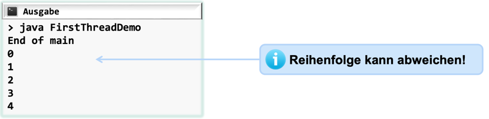

## run-Methode

```java
class FirstThread extends Thread {
    public void run() {
        for (int i = 0; i < 10; i++) {
            System.out.println(i + " ");
            try {
                Thread.sleep(100);
            } catch (InterruptedException e) {
                System.out.println(e);
            }
        }
        System.out.println("End of thread " + this.toString());
    }
}

public class FirstThreadDemo {
    public static void main(String[] args) {
        FirstThread thread = new FirstThread();
        thread.start();
        System.out.println("End of main");
    }
}
```



## Synchronisierung von Threads - join

Die Methode `join()` erlaubt es einem Thread, auf die Beendigung eines anderen Threads (hier: `t`) zu warten.
Wenn also `t` ein (parallel laufendes) Thread-Objekt ist, sorgt `t.join()` dafür, dass der aktuelle Thread (der, in
dessen Programmcode diese Zeile steht) so lange pausiert, bis `t` terminiert.
